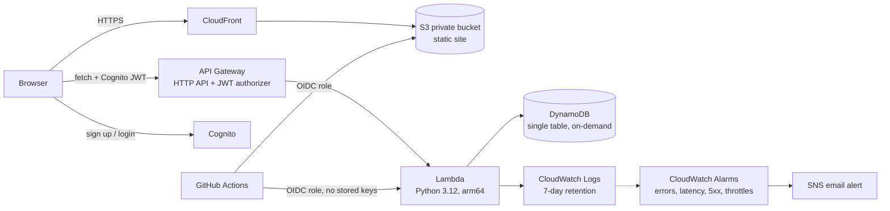

# LocalStay India

**Know the place before you book it.** A serverless homestay booking platform on AWS where every stay shows what the place is *really* like, and people who live there can review it.

Live demo: https://d9ci3vlczulbo.cloudfront.net

## The problem

Travel sites review the room. They do not tell you that the nearest hospital is 45 km away, that Swiggy and Zomato do not deliver there, or that only Airtel and BSNL have signal. In places like Ladakh and Spiti that matters.

## What is different

1. **Location Reality Card** on every stay: hospital distance, food delivery, mobile networks, ATM, altitude, road access. Rules turn risky values into warnings, and a booking in a high-risk place needs an explicit "I have read these limits" tick.
2. **Verified Locals:** residents apply, an admin checks a local address proof once, and only a yes/no is stored (no ID documents, no Aadhaar or passport numbers). Verified Locals can review the area (safety, how welcoming locals are, food, language, tips) on every stay in their city.
3. **Guest verification:** after a stay, guests confirm or dispute the host's claims. 3 confirmations show "Verified by 3 guests"; 2 disputes show "Disputed".
4. **Rule-based dynamic pricing:** `base x season x weekend x festival x demand`, clamped between 0.7x and 2x, computed on the server so clients cannot change prices.

## Architecture



All infrastructure is Terraform (`backend/infra`). Every push to `main` runs a GitHub Actions workflow that checks the Python code, then deploys the Lambda code and the frontend through an OIDC role limited to this repo and branch. Infrastructure changes are applied from a laptop with `deploy.ps1` (Terraform state is local).

**Monitoring:** CloudWatch alarms on Lambda errors, Lambda duration, API Gateway 5xx and DynamoDB throttling send an email through SNS. An AWS Budget alerts at 80% of $5.

## Design decisions

- **No double bookings:** one lock item per night; `TransactWriteItems` writes all nights plus the booking with a condition `attribute_not_exists OR hold_until < now`. If any night is taken, nothing is written.
- **10-minute holds:** dates are held while the guest pays. Expired holds count as free immediately (TTL cleans up later).
- **Single-table DynamoDB:** listings, bookings, reviews, local applications and local reviews share one table with two GSIs (city, user).
- **Least privilege:** the Lambda role only gets the DynamoDB actions and log writes it needs.
- **Cost:** HTTP API instead of REST API, ARM Lambda, on-demand DynamoDB, 7-day log retention, no NAT gateway, no EC2. Runs at roughly $0 to $2 per month at low traffic.
- **Defence in depth:** API Gateway JWT authorizer, plus a second login check inside the Lambda.

## Honest limitations

- **Payments are a demo.** No money moves. `DEMO_PAYMENTS=true` lets a user confirm their own booking; a real version confirms through a signed Razorpay webhook.
- **Listings, distances, ratings and season multipliers are sample data.** Real data would come from OpenStreetMap plus host input plus guest verification.
- **Local verification is manual** (admin runs `scripts/local_admin.py`). It is a workflow, not automated identity verification.
- Pricing is rule-based, not machine learning.

## Project layout

```
frontend/index.html         the website (single page)
backend/api/handler.py      Lambda: listings, bookings, reviews, verified locals
backend/infra/main.tf       DynamoDB, Lambda, Cognito, API Gateway, budget
backend/infra/hosting.tf    S3 + CloudFront
backend/scripts/seed.py     loads sample listings
backend/scripts/local_admin.py   approve Verified Local applications
deploy.ps1 / update.ps1     one-command deploy (Windows PowerShell)
```

## Deploy

Needs: AWS CLI (configured), Terraform, Python 3.

```
cd backend/infra
terraform init
terraform apply -var "budget_email=you@example.com"
python ../scripts/seed.py LocalStay ap-south-1
```
Put `api_url` and `client_id` from the output into `CFG` at the top of the script in `frontend/index.html`, then:
```
aws s3 cp frontend/index.html s3://<site_bucket>/index.html --content-type text/html
```
Remove everything with `terraform destroy`.

## Approving a Verified Local

```
python backend/scripts/local_admin.py list
python backend/scripts/local_admin.py approve person@example.com
```

## API

| Route | Login | Purpose |
|---|---|---|
| GET /listings, GET /listings/{id} | no | stays, reviews, verification, prices |
| POST /listings | yes | host adds a stay |
| POST /bookings | yes | hold nights (atomic) |
| POST /bookings/{lid}/{bid}/confirm | yes | demo confirm |
| GET /bookings/me | yes | my bookings |
| POST /reviews | yes | guest review + verify claims (after check-out) |
| POST /local/apply, GET /local/me | yes | Verified Local application and status |
| POST /local/reviews | yes (verified) | local review for your city |
| GET /local/reviews?city= | no | local reviews |

## Next

Razorpay (test mode) with webhook, OpenStreetMap distance import, "Ask a Local" Q&A, CI/CD with GitHub Actions, CloudWatch alarms.
