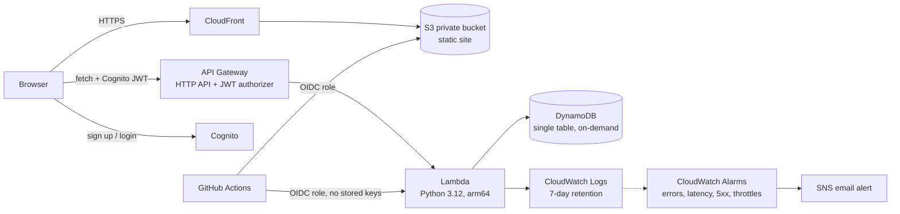

# LocalStay India

**Know the place before you book it.** A serverless homestay booking platform on AWS where every stay shows what the place is *really* like, and people who live there can review it.

Live demo: _add your CloudFront URL here_ (`terraform output site_url`)

## The problem

Travel sites review the room. They do not tell you that the nearest hospital is 45 km away, that Swiggy and Zomato do not deliver there, or that only Airtel and BSNL have signal. In places like Ladakh and Spiti that matters.

## What is different

1. **Location Reality Card** on every stay: hospital distance, food delivery, mobile networks, ATM, altitude, road access. Rules turn risky values into warnings, and a booking in a high-risk place needs an explicit "I have read these limits" tick.
2. **Verified Locals:** residents apply, an admin checks a local address proof once, and only a yes/no is stored (no ID documents, no Aadhaar or passport numbers). Verified Locals can review the area (safety, how welcoming locals are, food, language, tips) on every stay in their city.
3. **Guest verification:** after a stay, guests confirm or dispute the host's claims. 3 confirmations show "Verified by 3 guests"; 2 disputes show "Disputed".
4. **Rule-based dynamic pricing:** `base x season x weekend x festival x demand`, clamped between 0.7x and 2x, computed on the server so clients cannot change prices.

## Architecture



All infrastructure is Terraform (`backend/infra`). Every push to `main` runs a GitHub Actions workflow that checks the Python code, then deploys the Lambda code and the frontend through an OIDC role limited to this repo and branch. Infrastructure changes are applied from a laptop with `deploy.ps1` (Terraform state is local).

**Monitoring:** CloudWatch alarms on Lambda errors, Lambda duration, API Gateway 5xx and DynamoDB throttling send an email through SNS. An AWS Budget alerts at 80% of $5.

## Two deployments of the same API

The business logic lives in one file (`backend/api/handler.py`). It runs in two ways, against the same DynamoDB table and the same Cognito pool:

| | Serverless (main) | Container on EC2 (optional) |
|---|---|---|
| Entry point | API Gateway HTTP API + Lambda | FastAPI (`backend/ec2/app.py`) in Docker on one t3.micro |
| Cost when idle | About zero (pay per request) | Instance and public IP bill every hour while it runs |
| Scaling | Automatic, per request | One instance; scaling needs an Auto Scaling group and a load balancer |
| Cold start | Yes, a few hundred ms on first call | No, always warm |
| Ops work | None: no OS, no patching | Patch the OS, manage the container, restart on failure |
| HTTPS | Built in (CloudFront, API Gateway) | Not set up; needs a load balancer with a certificate |
| Auth | API Gateway JWT authorizer, plus guard in Lambda | The wrapper verifies the Cognito token (signature, issuer, audience), plus the same guard |
| Access to the box | None | No SSH port; SSM Session Manager only |

Why both: serverless suits small and spiky traffic and costs almost nothing; a container is easier to move, debug locally and run steady traffic. Because the handler is shared, the 50 automated tests cover both paths.

The EC2 version is **off by default** (`enable_ec2 = false`) to avoid cost. Turn it on or off from `backend/infra`:

```
terraform apply -var "budget_email=you@example.com" -var "enable_ec2=true"
terraform apply -var "budget_email=you@example.com" -var "enable_ec2=false"
```

Limitations of the EC2 version: HTTP only, a single instance, and the image is built on the instance at boot (a production setup would build in CI, push to ECR and use an Auto Scaling group behind a load balancer).

## Design decisions

- **No double bookings:** one lock item per night; `TransactWriteItems` writes all nights plus the booking with a condition `attribute_not_exists OR hold_until < now`. If any night is taken, nothing is written.
- **10-minute holds:** dates are held while the guest pays. Expired holds count as free immediately (TTL cleans up later).
- **Single-table DynamoDB:** listings, bookings, reviews, local applications and local reviews share one table with two GSIs (city, user).
- **Least privilege:** the Lambda role only gets the DynamoDB actions and log writes it needs.
- **Cost:** HTTP API instead of REST API, ARM Lambda, on-demand DynamoDB, 7-day log retention, no NAT gateway, no EC2. Runs at roughly $0 to $2 per month at low traffic.
- **Defence in depth:** API Gateway JWT authorizer, plus a second login check inside the Lambda.

## Honest limitations

- **Payments run in Razorpay test mode.** The full flow is real (order, checkout, signature check, webhook) but no real money moves. Going live needs Razorpay KYC and live keys. Without keys in SSM the app falls back to a demo confirm (`DEMO_PAYMENTS`).
- **Listings, distances, ratings and season multipliers are sample data.** Real data would come from OpenStreetMap plus host input plus guest verification.
- **Local verification is manual** (admin runs `scripts/local_admin.py`). It is a workflow, not automated identity verification.
- Pricing is rule-based, not machine learning.

## Project layout

```
frontend/index.html         the website (single page)
backend/api/handler.py      Lambda: listings, bookings, reviews, verified locals
backend/infra/main.tf       DynamoDB, Lambda, Cognito, API Gateway, budget
backend/infra/hosting.tf    S3 + CloudFront
backend/scripts/seed.py     loads sample listings
backend/scripts/local_admin.py   approve Verified Local applications
deploy.ps1 / update.ps1     one-command deploy (Windows PowerShell)
```

## Deploy

Needs: AWS CLI (configured), Terraform, Python 3.

```
cd backend/infra
terraform init
terraform apply -var "budget_email=you@example.com"
python ../scripts/seed.py LocalStay ap-south-1
```
Put `api_url` and `client_id` from the output into `CFG` at the top of the script in `frontend/index.html`, then:
```
aws s3 cp frontend/index.html s3://<site_bucket>/index.html --content-type text/html
```
Remove everything with `terraform destroy`.

## Approving a Verified Local

```
python backend/scripts/local_admin.py list
python backend/scripts/local_admin.py approve person@example.com
```

## API

| Route | Login | Purpose |
|---|---|---|
| GET /listings, GET /listings/{id} | no | stays, reviews, verification, prices |
| POST /listings | yes | host adds a stay |
| POST /bookings | yes | hold nights (atomic) |
| POST /bookings/{lid}/{bid}/confirm | yes | demo confirm (closed when Razorpay is on) |
| POST /bookings/{lid}/{bid}/pay-order | yes | create Razorpay order, amount computed on server |
| POST /bookings/{lid}/{bid}/verify | yes | verify checkout HMAC signature, confirm booking |
| GET /config | no | payment mode and public key id |
| POST /razorpay/webhook | no | signed webhook, authoritative confirmation |
| GET /bookings/me | yes | my bookings |
| POST /reviews | yes | guest review + verify claims (after check-out) |
| POST /local/apply, GET /local/me | yes | Verified Local application and status |
| POST /local/reviews | yes (verified) | local review for your city |
| GET /local/reviews?city= | no | local reviews |

## Next

Razorpay (test mode) with webhook, OpenStreetMap distance import, "Ask a Local" Q&A, CI/CD with GitHub Actions, CloudWatch alarms.


## Payments (Razorpay, test mode)

1. Browser asks the API for an order. The server computes the amount (stay + 10% fee) and creates the Razorpay order; the client never sends a price.
2. Razorpay Checkout collects the payment. The browser sends back `order_id`, `payment_id`, `signature`; the server checks the HMAC-SHA256 with the key secret.
3. A signed webhook (`payment.captured`) also confirms the booking, so a closed tab does not lose a paid booking. Confirmation is idempotent.
4. If the dates were lost while the user was paying (hold expired and someone else booked), the payment is refunded automatically.
5. Keys live in SSM Parameter Store (SecureString), never in code or env files. The role gets read access to `/localstay/razorpay/*` only.

## Email notifications (SES)

When a booking is confirmed (browser verify or webhook, whichever wins), the guest gets an email from SES. It is best-effort: a mail failure is logged and never undoes a paid booking, and only the call that actually confirmed the booking sends the mail, so replays do not send duplicates. New AWS accounts start in the SES sandbox, which only delivers to verified addresses; production access is a form request to AWS.

## Load test and state

- `backend/scripts/loadtest.py` runs against the live API: N guests book the same two nights at the same instant (exactly one must win, the rest get 409), then a read load on `/listings` reports p50/p95 latency. It creates temporary Cognito users and a temporary listing and removes them afterwards. Its logic is also covered by an in-process test.
- Terraform state is in a versioned, encrypted S3 bucket with a DynamoDB lock (`backend.tf`), created once by `backend/scripts/bootstrap_state.ps1`.
